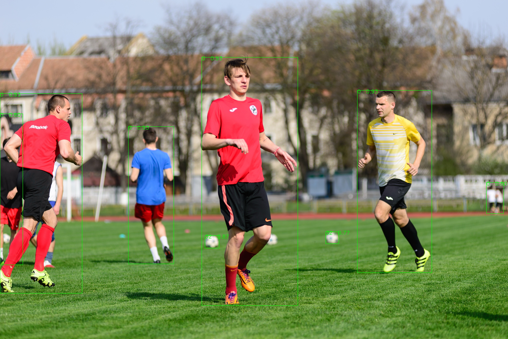
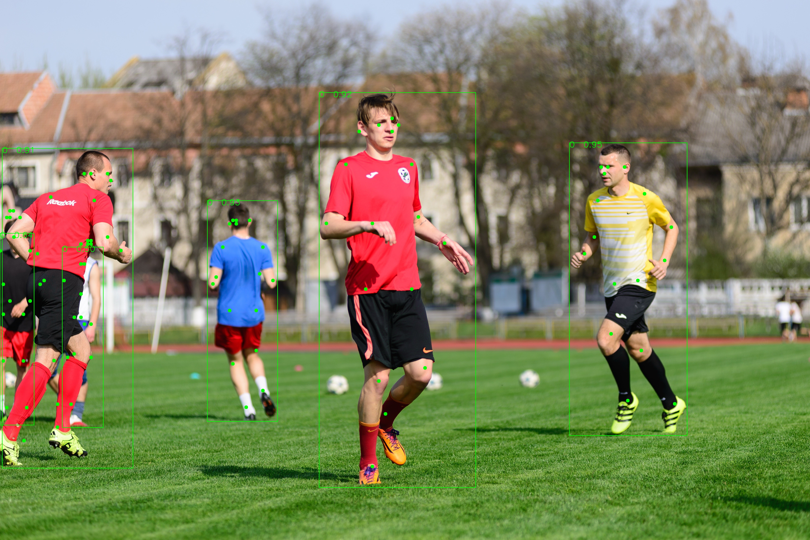

# libdet.axera

---
## Build Instructions

### x86 Build

```bash
git clone https://github.com/AXERA-TECH/libdet.axera.git
cd libdet.axera
sudo apt install libopencv-dev build-essential 
./build.sh
```

### AArch64 Build

#### Cross-compile for aarch64

```bash
git clone https://github.com/AXERA-TECH/libdet.axera.git
cd libdet.axera
./build_aarch64.sh
```

#### Native Build on Target Board

```bash
git clone https://github.com/AXERA-TECH/libdet.axera.git
cd libdet.axera
sudo apt install libopencv-dev build-essential
./build.sh
```
---

## Get Model

- [YOLOv8](https://huggingface.co/AXERA-TECH/YOLOv8)
- [YOLO11](https://huggingface.co/AXERA-TECH/YOLO11)
- [YOLO11 Pose](https://huggingface.co/AXERA-TECH/YOLO11-Pose)

## Usage Example
### YoloV8
```shell
./test_det -m yolov8s.axmodel -t 1 -i pexels-володимир-король-16499013.jpg 
open libax_sys.so failed
open libax_engine.so failed
[I][                             run][  31]: AXCLWorker start with devid 0
[I][                            init][  75]: model_type: 1, threshold:  0.25, nms_threshold:  0.45, num_classes: 80, num_kpt: 0
[I][                            init][  93]: mean:  0.00,  0.00,  0.00
[I][                            init][  94]: std:  0.00,  0.00,  0.00

input size: 1
    name:   images [unknown] [unknown] 
        1 x 640 x 640 x 3


output size: 3
    name: /model.22/Concat_output_0 
        1 x 80 x 80 x 144

    name: /model.22/Concat_1_output_0 
        1 x 40 x 40 x 144

    name: /model.22/Concat_2_output_0 
        1 x 20 x 20 x 144

[I][                            init][ 164]: input_w: 640, input_h: 640, is_input_nchw: false
[I][                            init][ 172]: nElements: 1228800, m_runner->get_input(0).nSize: 1228800, is_input_fp32: false
num_objs: 8
[I][                             run][  81]: AXCLWorker exit with devid 0
```


### Yolo11 Pose
```shell
./test_det -m yolo11x-pose.axmodel -t 4 -i pexels-володимир-король-16499013.jpg --num_kpt 17
open libax_sys.so failed
open libax_engine.so failed
[I][                             run][  31]: AXCLWorker start with devid 0
[I][                            init][  75]: model_type: 4, threshold:  0.25, nms_threshold:  0.45, num_classes: 80, num_kpt: 17
[I][                            init][  93]: mean:  0.00,  0.00,  0.00
[I][                            init][  94]: std:  0.00,  0.00,  0.00

input size: 1
    name:   images [unknown] [unknown] 
        1 x 640 x 640 x 3


output size: 6
    name: /model.23/Concat_1_output_0 
        1 x 80 x 80 x 65

    name: /model.23/Concat_2_output_0 
        1 x 40 x 40 x 65

    name: /model.23/Concat_3_output_0 
        1 x 20 x 20 x 65

    name: /model.23/cv4.0/cv4.0.2/Conv_output_0 
        1 x 80 x 80 x 51

    name: /model.23/cv4.1/cv4.1.2/Conv_output_0 
        1 x 40 x 40 x 51

    name: /model.23/cv4.2/cv4.2.2/Conv_output_0 
        1 x 20 x 20 x 51

[I][                            init][ 164]: input_w: 640, input_h: 640, is_input_nchw: false
[I][                            init][ 172]: nElements: 1228800, m_runner->get_input(0).nSize: 1228800, is_input_fp32: false
num_objs: 6
[I][                             run][  81]: AXCLWorker exit with devid 0
```



## Community
QQ 群: 139953715
